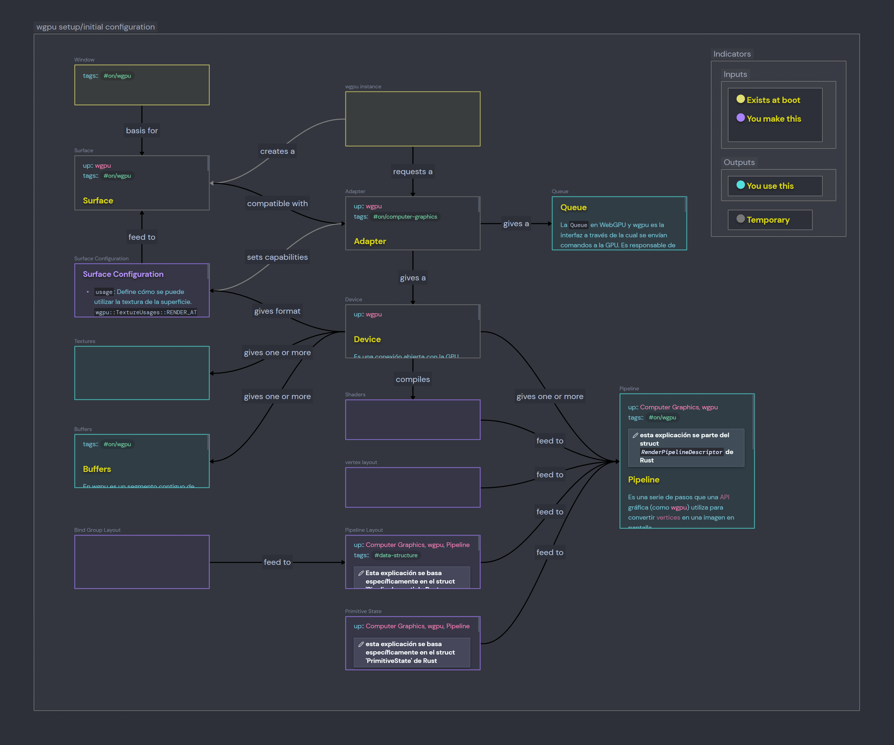

# rust-graphics

## mindmaps
in this section i will share some mind maps i have made to help me in self-thought rust graphics journey.

### Initial/Setup configuration
A canvas i made in obsidian. Is subjected to changes as i am still digesting a lot of concepts, just give me a breath.

### Per-frame
im still working in a mindmap that will represent what happens at each frame